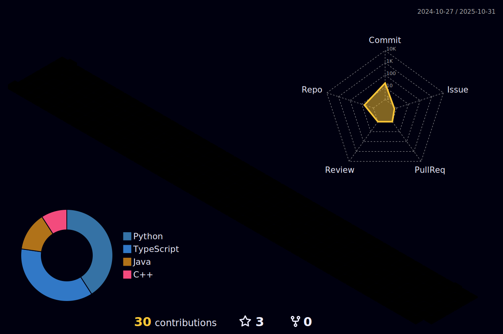

# Hi there, I'm Cauã Ferraz 👋

|  |  |  
| ----------- | ----------- |

  
   

  

## About Me

I'm a **Senior FullStack Developer** with extensive experience in building scalable and efficient applications. Passionate about leveraging technology to solve real-world problems and continuously learning new technologies.

### 🔧 Technologies & Tools

## 🚀 Projects

### [AILib](https://github.com/Caua-ferraz/AILib)

Just another normal AILib.  
**Language:** Python  
**⭐ Stars:** 1

### [AImagine_test](https://github.com/Caua-ferraz/AImagine_test)

A simple project to test AI image generation capabilities.  
**Language:** Python  
**⭐ Stars:** 1

### [BilQuick_Boilerplate](https://github.com/Caua-ferraz/BilQuick_Boilerplate)

A comprehensive TypeScript boilerplate for rapid project setup.  
**Language:** TypeScript  
**⭐ Stars:** 1

### [Phisic-simualtion](https://github.com/Caua-ferraz/Phisic-simualtion)

Physics simulation project focusing on realistic motion and interactions.  
**Language:** Python

### [Lamberts_solver](https://github.com/Caua-ferraz/Lamberts_solver)

A Lambert's solver still in the development process, aimed at solving orbital mechanics problems.  
**Language:** Python

### [swarm](https://github.com/Caua-ferraz/swarm)

Forked from openai/swarm.  
Educational framework exploring ergonomic, lightweight multi-agent orchestration. Managed by OpenAI Solution team.  
**Language:** Python  
**⭐ Stars:** 1

## 📊 GitHub Stats

## 📝 Latest Contributions

<!-- Add your latest contributions here -->

## 📫 Get in Touch

---

© 2024 GitHub, Inc.
